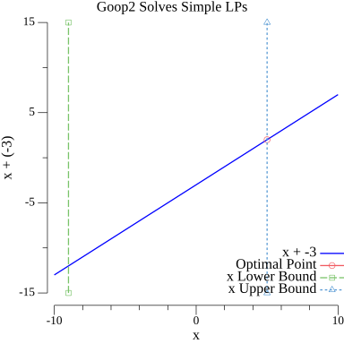

# goop2
This project is meant to implement an optimization toolbox with nice default features like MATLAB's YALMIP. It is a spiritual successor to the goop library from MIT's Distributed Robotics Lab. This version is meant to be written in pure Go and makes use of my own low-level library for interfacing with Gurobi.

|   |
|:--------------------:|
| Goop2 Can Solve Simple LPs |

## Installation

Warning: The setup script is designed to only work on Mac OS X. If you are interested in using this on a Windows machine, then there are no guarantees that it will work.

### Development Installation (Installation from a Git Repository)

When you have cloned this repository and want to begin testing it, then you simply need to run the following command: `sudo go generate`. A log file will be created in `extras` describing how the installation went. If it fails, feel free to reach out to kwesiRutledge.

## Examples

There are several examples in the test files. Check out `lp_solve_test.go` for an example.