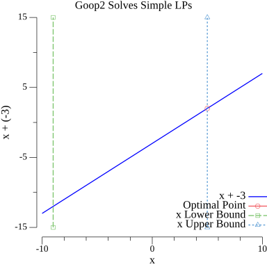

# goop2
This project is meant to implement an optimization toolbox with nice default features like MATLAB's YALMIP. It is a spiritual successor to the goop library from MIT's Distributed Robotics Lab. This version is meant to be written in pure Go and makes use of my own low-level library for interfacing with Gurobi.

|   |
|:--------------------:|
| Goop2 Can Solve Simple LPs |

## Installation

Warning: The setup script is designed to only work on Mac OS X. If you are interested in using this on a Windows machine, then there are no guarantees that it will work.

### Development Installation (Installation from a Git Repository)

When you have cloned this repository and want to begin testing it, then you simply need to run the following command: `sudo go generate`. A log file will be created in `extras` describing how the installation went. If it fails, feel free to reach out to kwesiRutledge.

## Examples

We aim to include examples for how to use Goop2 in a Wiki page [here](https://github.com/kwesiRutledge/goop2/wiki/Examples).

Some extra examples can also be found in the test files. 
Check out the files in `testing/solvers` for such examples (for example, `lp_solve_test.go` contains an example of a Linear Program).

## To-Dos

- Create New AddConstr methods which work for vector constraints
- Mult 
  - General Function (in operators.go)
  - Methods for
    - Scalars
      - Constant
      - Var
      - ScalarLinearExpression
      - QuadraticExpression
    - Vectors
      - Vector Constant
      - VarVector
      - VectorLinearExpression
- Plus
  - General Function (in operators.go)
  - Methods for
    - Vectors
      - Vector Constant
      - VarVector
      - VectorLinearExpression
- Introducing Optional Input for Variable Name to Var/VarVector
- Consider renaming VarVector to VectorVar
- VarVector
  - Plus
  - Multiply
  - LessEq
  - GreaterEq
  - Eq
  - Len
- Decide whether or not we really need the Coeffs() method (What is it doing?)
- Create function for easily creating MatDense:
  - zeros matrix 
  - ones matrices 
  - (and Identity)